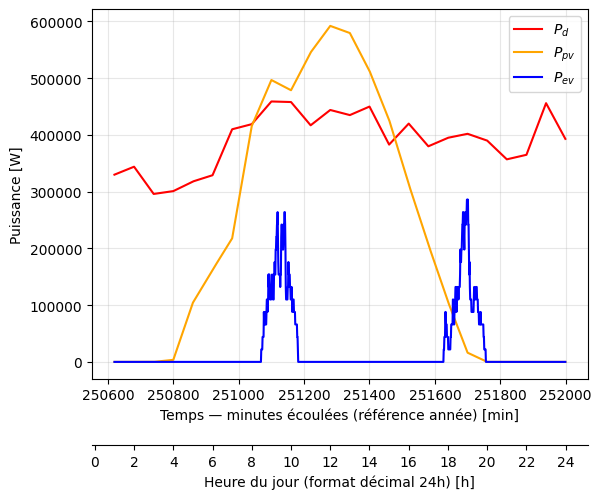
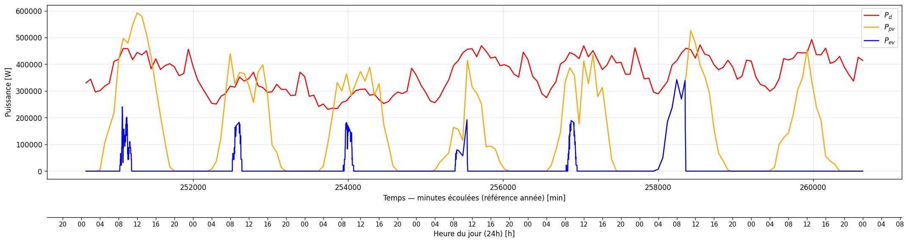
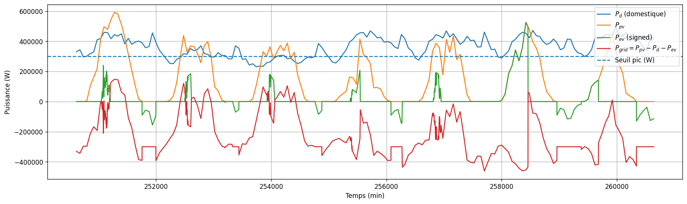

# Smart EV Charging & Vehicle-to-Grid Optimization

Python-based simulation and optimization of smart EV charging and bidirectional Vehicle-to-Grid strategies with photovoltaic integration.

## Project Overview

The increasing adoption of electric vehicles can create additional stress on electricity networks when many vehicles charge simultaneously during peak-demand periods.

This project studies the integration of a fleet of **50 electric vehicles** into a local electricity system partially supplied by photovoltaic generation.

The objective is to model EV charging demand and evaluate strategies that:

- reduce additional grid demand peaks,
- shift charging toward periods of high photovoltaic production,
- increase local solar energy utilization,
- maintain vehicle charging requirements,
- improve the overall load profile,
- explore bidirectional Vehicle-to-Grid operation.

## System Model

The simulated system includes:

- 50 electric vehicles,
- 52 kWh battery capacity per vehicle,
- 22 kW normal charging power,
- a 500 kWp photovoltaic installation,
- local electricity demand,
- solar irradiance and ambient temperature data.

EV usage is based on daily commuting between home and work.

## Methodology

### 1. EV Demand Modelling

Electric vehicle charging demand was modelled using stochastic mobility assumptions.

Departure times, commuting distances and charging behaviour were randomly sampled to generate multiple possible charging profiles.

Monte Carlo simulations were used to represent the variability of EV mobility patterns and identify a representative fleet charging profile.

### 2. Photovoltaic Generation

Photovoltaic production was simulated using:

- solar irradiance,
- ambient temperature,
- nominal PV capacity,
- module temperature effects.

The input data were interpolated at a one-minute time resolution to compare electricity demand, EV charging and PV generation throughout the day.

### 3. Unidirectional Smart Charging

A rule-based charging strategy was implemented to improve the integration of EVs into the local electricity system.

The strategy prioritizes charging during periods of high photovoltaic generation while avoiding additional demand during existing grid peaks.

The approach aims to:

- shift charging toward midday,
- limit aggregated EV charging power,
- avoid increasing evening demand peaks,
- improve PV self-consumption.

Two main parameters were explored:

- `cap_factor`: maximum share of PV generation available for EV charging,
- `k_need`: share of daily energy demand to be recovered through charging.

### 4. Load-Smoothing Indicator

To evaluate grid impact, a load-smoothing indicator was defined as:

**J = mean(ΔP_grid²)**

where:

**ΔP_grid(t) = P_grid(t) - P_grid(t-1)**

A lower value of `J` corresponds to a smoother electricity demand profile.

### 5. Scenario Optimization

Different combinations of `cap_factor` and `k_need` were tested.

Among the evaluated scenarios, the configuration:

- `cap_factor = 0.30`
- `k_need = 0.80`

provided the lowest smoothing indicator while maintaining sufficient vehicle charging.

### 6. Bidirectional Vehicle-to-Grid

The model was extended to allow electric vehicles to discharge energy back to the grid during high-demand periods.

Discharging is activated only when:

- the vehicle is connected,
- the battery state of charge remains above a minimum reserve,
- photovoltaic production is low or unavailable,
- grid demand exceeds a predefined threshold.

The grid power is calculated as:

**P_grid = P_d + P_ev - P_pv**

where `P_ev` is positive during charging and negative during V2G discharge.

This strategy aims to reduce evening demand peaks while preserving sufficient battery energy for future mobility.

## Technologies

- Python
- NumPy
- Pandas
- Matplotlib
- ipywidgets
- Excel data processing
- Monte Carlo simulation
- Rule-based control
- Scenario optimization
- Energy systems modelling
- Data visualization

## Key Results

The simulations show that coordinated EV charging can improve the integration of electric mobility into a local energy system.

For the unidirectional smart-charging case, several combinations of `cap_factor` and `k_need` were evaluated.

The selected configuration:

- `cap_factor = 0.30`
- `k_need = 0.80`

provided the lowest load-smoothing indicator among the tested scenarios while maintaining sufficient vehicle charging.

The smart charging strategy:

- shifted EV charging toward periods of high photovoltaic production,
- reduced additional evening demand,
- improved alignment between EV charging and PV generation,
- limited charging-related power peaks,
- improved the smoothness of the grid demand profile.

For the bidirectional case, the model allowed connected EVs to discharge during high-demand periods while maintaining a minimum battery reserve.

This V2G strategy reduced the effective grid demand during peak periods by using EV batteries as distributed flexibility resources.

## Results Visualization

### EV Demand and PV Generation



Monte Carlo simulation was used to model EV charging demand for a fleet of 50 vehicles, while photovoltaic generation was simulated from solar irradiance and ambient temperature data.

### Unidirectional Smart Charging



The charging strategy shifts EV demand toward periods of high photovoltaic production and limits additional stress on the electricity grid.

### Bidirectional Vehicle-to-Grid



The bidirectional strategy allows EVs to discharge during high-demand periods, contributing to peak shaving while maintaining a minimum battery state of charge.

## My Contribution

This project was developed in a two-person team.

My contributions included:

- modelling EV charging demand and photovoltaic generation,
- implementing and testing smart charging strategies in Python,
- analysing grid-load behaviour and charging scenarios,
- evaluating load-smoothing performance,
- contributing to the bidirectional V2G implementation and interpretation of results,
- preparing technical analysis and project documentation.

## Repository Structure

```text
smart-ev-charging-v2g-optimization/
│
├── README.md
├── .gitignore
│
├── notebooks/
│   ├── 01_ev_pv_modelling.ipynb
│   ├── 02_unidirectional_smart_charging.ipynb
│   └── 03_bidirectional_v2g.ipynb
│
├── data/
│   └── TP-V2G-Input_data.xlsx
│
├── figures/
│   ├── 01_ev_demand_and_pv_generation.png
│   ├── 02_unidirectional_smart_charging.png
│   └── 03_bidirectional_v2g_peak_shaving.png
|
└── report/
    └── project_report.pdf

## Project Context

This project was developed as a two-person academic project at IMT Atlantique focused on demand-side management, electric mobility, photovoltaic integration and Vehicle-to-Grid strategies.

## References

- IMT Atlantique — Demand-side management and Vehicle-to-Grid modelling exercise
- Enedis — *Pilotage de la recharge de véhicules électriques: opportunité pour le consom'acteur et le réseau public de distribution d'électricité* (2020)
